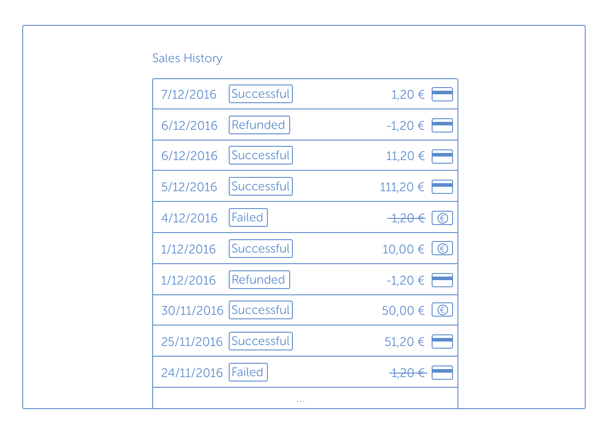

# Build your own Sales History

## Summary of the task

You will do phase 1 at home, and the other phases we will complete
during pair programming in the office.

### Phase 1: Basic list of sales

### API

Your task is to generate a dataset containing 6 months worth of sales, and then display that in a simple list view. You must generate the data programmatically, and may not use a third-party generator. Feel free to reuse the code that you wrote for the initial coding quiz. You can use the Express server provided to create an endpoint, which will provide a subset of this data to the client (perhaps initially limited to 100 sales items or so).

**Requirements:**

 - You must generate the data programmatically

---

### UI

Create a simple page where you have to fetch from your API and display the data into a list. Use your creativity here to list them. Our suggestion is that it _could_ look like the mockup below.

**User story:**

 - **As a** Sumup user
 - **I want** to have a page to see my transactions listed by date
 - **so that** I can see the newest sales first 



## Getting started

### Guiding principles

* Strive for a balance between 'doing it right' and 'not over-engineering' based on the task
* Think about code you would put in a shared codebase
* When in doubt, ask!

### Your tools

* An Express server, equipped with Nodemon so it restarts upon changes
* React base app with built by webpack, based on create-react-app with configuration for jest, enzyme and react-testing-library

### Get it running

```bash
npm start # Run client
npm run start:server # Run server
npm test # Run tests
```
